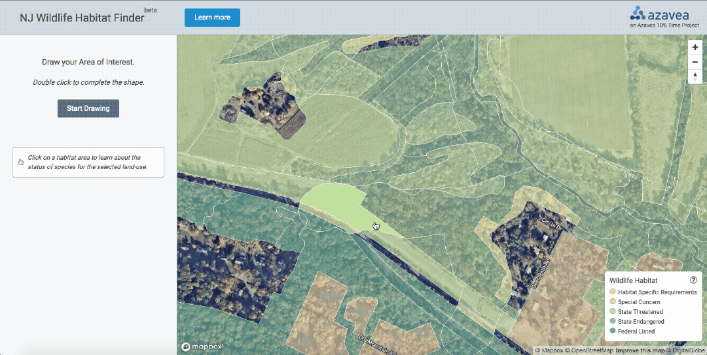

## NJ Wildlife Habitat Finder

### Background
The NJDEP maintains a statewide wildlife habitat data set that details conservation requirements. Using desktop GIS software, a site-specific search is a time-intensive process, taking minutes or hours to run geoprocessing operations for specific properties.

Now, by leveraging advances in web-based mapping technology, a user can draw a custom area in a browser window and return results in seconds.

### More information
- [Project overview and data description](http://www.azavea.com/blog/2018/08/23/new-jersey-wildlife-habitat)
- [Convert Geodatabase Vector Data with Related Tables to Vector Tiles]()
- [How to Save a Mapbox GL Web Map Extent as an Image]()

### Demo
Try the tool ([NJ Wildlife Habitat Finder](https://njwildlife.azavea.com/app/index.html#7/40.196/-74.596)): zoom to an area by typing an address into the search bar or by using the zoom navigation buttons. Then, draw a custom shape to display a list of wildlife habitat within the selected area.

Checking a property habitat inventory during environmental permitting process:


### Goals

- Define a process for interacting with large vector data sets in a browser using open source libraries
- Test a method for appending related table data to vector tiles as JSON objects
- Create a Proof of Concept data processing workflow that can be applied to similar situations
- Design an application that allows a user to interact with the data in a browser

### Results

- Established a repeatable workflow for a common scenario across sectors: processing geodatabase files to vector tiles for access in web applications
- Provided a resource for planners and conservationists in New Jersey


## Development

### Requirements

* Docker 18_

### Preparing the data

Build the data preperation docker container

```sh
./scripts/update
```


Download and process the data.

```sh
./scripts/data-prep
```

### Edit access token and host information

Edit `src/app/config.js`: add your [Mapbox Access Token](https://www.mapbox.com/studio/account/tokens/)

To point at your own data that was prepared in the previous step,
you'll need to serve it out in some publicly accessible endpoint, and modify
the `HOST` configuration variable in `src/app/config.js` such that the tiles are available at
`${HOST}/tiles/[TILE SET]/{z}/{x}/{y}`.

### Run the development server

```sh
./scripts/server
```

Visit: [http://localhost:8000/](http://localhost:8000/)
