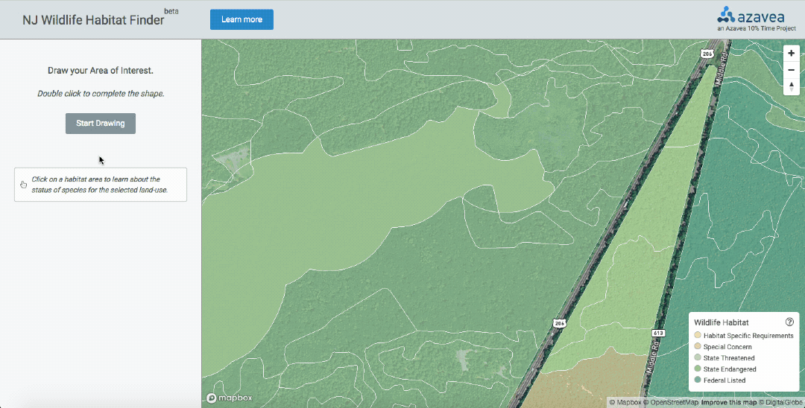

### Background
[NJ Landscape Project data](http://www.state.nj.us/dep/fgw/ensp/landscape/index.htm) is a database that combines imperiled and priority species location information with land-use/land-cover (LULC) data. Landscape Project species habitat areas are determined by running species-specific models on a wildlife observation point dataset. NJDEP ENSP biologists create habitat models for each NJ Special Concern, Threatened, or Endangered species, including Federally Threatened or Endangered species. These models use a combination of species biology (i.e. movement patterns, habitat preferences, home ranges, etc) and statewide land-use land-cover polygons to create potential habitat areas ([see Landscape Project Report v3.3, page 18-23](http://www.state.nj.us/dep/fgw/ensp/landscape/lp_report_3_3.pdf)).

The dataset has hundreds of thousands of polygons with continuous, topological coverage for the entire state and several associated tables with rich attribute information about habitat type and wildlife. In total, the dataset includes about 1 million polygons. This open data set is provided as a Geodatabase that includes vector data and related tabular data. Basic geospatial operations can take minutes or hours to process due to the size of the dataset and the workflow required.

This Proof of Concept investigates a workflow to process this dataset into vector tiles that can be rendered responsively in a web browser. Now a user can draw a custom area in a browser window and return results in seconds, enabling efficient compliance with environmental regulations.

Multiple open source libraries/tools like GDAL ogr2ogr, Mapbox Tippecanoe, and Mapbox GL JS are used in this workflow.

### Demo
Draw an Area of Interest, get list of wildlife habitat.

Checking a Greenfield property habitat inventory during permitting process:


Linear utility right-of-way environmental inventory:


### Goals

- define a process for interacting with large vector data sets in a browser using open source libraries
- create a Proof of Concept that can be applied to similar situations
- free up consultant time for other tasks
- encourage industry-adoption of open source tools

### Requirements

* Docker 18_

### Preparing the data

Build the data preperation docker container

```sh
./scripts/update
```


Download and process the data.

```sh
./scripts/data-prep
```

### Edit access token and host information

Edit `src/app/config.js` with your [Mapbox Access Token](https://www.mapbox.com/studio/account/tokens/)

To point at your own data that was prepared in the previous step,
you'll need to serve it out in some publicly accessible endpoint, and modify
the `HOST` configuration variable in `src/app/config.js` such that the tiles are available at
`${HOST}/tiles/[TILE SET]/{z}/{x}/{y}`.

### Run the development server

```sh
./scripts/server
```

Visit: [http://localhost:8000/](http://localhost:8000/)
